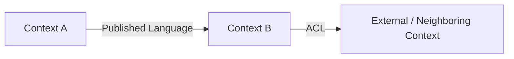

# Product Architecture: [PRODUCT NAME]

**Created**: [DATE]  
**Status**: Draft  

## Scope

Define the product-level architecture that all feature work must respect. This artifact is the durable source of truth for bounded contexts, context relationships, and architecture constraints across `specs/`.

- **Product mission**: [What product outcome this architecture supports]
- **Architecture horizon**: [Current product scope, stage, or planning horizon]
- **Primary stakeholders**: [Business owners, operators, partner teams, or customers]

## Product Summary

Summarize the product in domain terms, focusing on the major business capabilities and why clear bounded contexts matter.

## Architectural Drivers

- **Business drivers**: [Revenue, compliance, operational, partner, or customer drivers]
- **Domain complexity drivers**: [Where language, workflow, or policy complexity appears]
- **Quality attributes**: [Consistency, auditability, latency, resilience, autonomy, etc.]
- **Change drivers**: [Likely product evolution that may pressure current boundaries]

## Domain Landscape and Subdomains

| Subdomain | Classification | Core Capability | Notes |
|-----------|----------------|-----------------|-------|
| [Subdomain] | [Core/Supporting/Generic] | [What business capability it provides] | [Boundary or ownership note] |

## Bounded Contexts

| Context | Purpose | Owns | Does Not Own | Upstream / Downstream | Team / Ownership |
|---------|---------|------|--------------|-----------------------|------------------|
| [Context Name] | [Why it exists] | [Key responsibilities and concepts] | [Important exclusions] | [Main context relationships] | [Owning team or role] |

For each bounded context, clarify:

- **Model boundary**: [What language and rules are local to this context]
- **Consistency boundary**: [What must stay transactional or strongly consistent here]
- **Published interfaces**: [Events, APIs, reports, or artifacts exposed to neighbors]
- **Anti-corruption needs**: [Where translation or shielding is required]

## Context Map

Describe the primary bounded-context relationships and collaboration patterns.

| Source Context | Target Context | Relationship Pattern | Interaction Style | Notes |
|----------------|----------------|----------------------|-------------------|-------|
| [Context A] | [Context B] | [Customer/Supplier, Conformist, ACL, Shared Kernel, etc.] | [sync/async/manual] | [Important constraints or failure notes] |

## Ubiquitous Language

| Term | Canonical Meaning | Context Scope | Notes |
|------|-------------------|---------------|-------|
| [Term] | [Meaning] | [Global or specific context] | [Potential confusion to avoid] |

## Integration and Coordination Rules

- **Cross-context communication**: [How commands, queries, and events should flow]
- **Data ownership**: [Which context is source of truth for critical concepts]
- **Consistency approach**: [Strong consistency, eventual consistency, compensation, etc.]
- **External systems**: [How neighboring systems are represented and isolated]
- **Observability / auditability**: [What architectural decisions or transitions must be traceable]

## Architecture Constraints for Feature Work

Future `spec.md`, `plan.md`, `tasks.md`, and `domain-model.md` artifacts must align with these constraints:

- **Context alignment**: [Each feature must name the primary bounded context and affected neighbors]
- **Boundary protection**: [No direct leakage of another context's internal model]
- **Integration contracts**: [Required contract style, translation, or event discipline]
- **Terminology discipline**: [Terms that must stay consistent across artifacts and code]
- **Change governance**: [When a feature must trigger an update to `specs/architecture.md`]

## Existing Requirements Considered

List the current product requirements or feature specs that influenced this architecture.

- `specs/[feature-a]/spec.md`: [How it shaped the bounded-context design]
- `specs/[feature-b]/plan.md`: [How it confirmed or challenged current boundaries]
- `[Additional artifact]`: [Architectural implication]

## Evolution Notes

- **Current tensions**: [Boundary pressure, ownership ambiguity, or integration pain]
- **Planned refactor seams**: [Likely future architecture adjustments]
- **Recently updated decisions**: [What changed and why]

## Open Questions and Watchpoints

- **Open Question**: [Unknown that could materially change the architecture]
  **Why it matters**: [Boundary or strategy impact]
- **Watchpoint**: [Signal that should trigger a bounded-context review]
